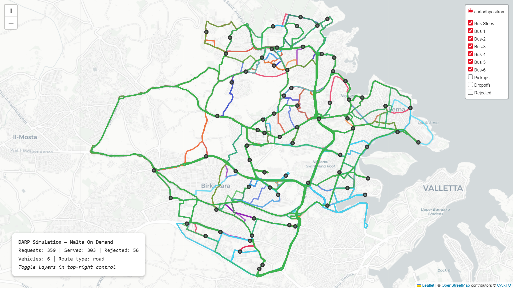

# Dynamic Bus Routing for On-Demand Public Transport

> **BSc (Hons) AI thesis — University of Malta, June 2026**
> Miguel Baldacchino · Supervisor: Dr Josef Bajada

A modular discrete-event simulation and benchmarking framework for the **Dynamic Dial-a-Ride Problem (D-DARP)**, calibrated to Malta's *tallinja On Demand* service. Six routing-policy families — greedy insertion, SA, TS, GA, ALNS, and Maskable-PPO RL — are compared across 45 configurations under identical demand streams and travel-time noise.

<p align="center">
  
  <br/>
  <sub>Sample run: 6 buses · 359 requests · 303 served · 56 rejected — toggle layers in the interactive <a href="docs/simulation_map.html">map.html</a></sub>
</p>

---

## Repository layout

```
odpt/
├── main.py                   # Entry point — runs one simulation episode
├── config.py                 # SimulationConfig dataclass (all hyperparameters)
├── dispatcher.py             # Policy-agnostic dispatch_request() interface
├── feasibility.py            # DARP constraint checker (capacity, TW, ride-time)
├── metrics.py                # MetricsCollector → summary dict / report
├── models.py                 # Request, Vehicle, Stop dataclasses
├── benchmark.py              # Multi-seed, multi-policy orchestrator
│
├── malta_travel.py           # OSRM matrix + time-of-day congestion scaling
├── malta_travel_matrix.json  # Pre-built 72×72 road-network travel-time matrix
├── build_osrm_matrix.py      # Rebuilds matrix from scratch (Docker + OSRM)
├── stops.csv                 # 72 tallinja On Demand stops (lat/lon)
│
├── sa_policy.py              # Simulated Annealing improver
├── ts_policy.py              # Tabu Search improver
├── ga_policy.py              # Genetic Algorithm improver
├── alns_policy.py            # Adaptive Large Neighbourhood Search improver
│
├── rl_env.py                 # Gymnasium env (DARPEnv) — MaskablePPO
├── rl_train.py               # Basic PPO training script
├── rl_tune_RL1-1.py          # Optuna tuning — Strategy 1 (standalone RL)
├── rl_tune_RL2-0.py          # Optuna tuning — Strategy 2 (TS-initialiser)
├── rl_outputs/               # Saved model checkpoints (.zip)
│
├── visualize.py              # Folium HTML map generator
├── route_cache.json          # OSRM road-geometry cache for visualisation
│
Benchmark Results/
├── Baseline - Default Config/
│   ├── baseline_report.txt   # Full metric tables across 45 policies × 5 seeds
│   └── runs/                 # Per-run JSON files
└── sensitivity_results/
    ├── demand_busy/          # ×1.5 demand intensity
    ├── fleet_4/              # Fleet size 4
    ├── capacity_8/           # Vehicle capacity 8
    ├── wait_15/              # Max wait Wmax = 15 min
    ├── ride_factor_2/        # Ride-time factor α = 2.0
    └── combined_stress/      # All degradations simultaneously
```

---

## Quick start

```bash
pip install simpy stable-baselines3 sb3-contrib gymnasium folium optuna

# Single run — default policy (greedy+sa), seed 42
python main.py

# Specify policy and seed
python main.py --policy greedy+alns --seed 100

# RL hybrid (requires a trained model)
python main.py --policy rl+ts --model rl_outputs/run_009/model_final.zip

# Full benchmark (all policies, 5 seeds)
python benchmark.py

# Generate interactive map for last run
python main.py --policy greedy+alns --seed 42
# → simulation_map.html
```

---

## Simulation parameters (`config.py`)

| Parameter | Default | Notes |
|---|---|---|
| `fleet_size` | 6 | MPT On Demand fleet |
| `vehicle_capacity` | 16 | Minibus seats |
| `depot_node` | 0 | Ħal Qormi – Bankieri |
| `n_nodes` | 71 | Service-area stops (0 = depot) |
| `n_requests` | 400 | ~18 requests/hour over 17-hour day |
| `service_end` | 1020 min | 22:30 — last request accepted |
| `horizon` | 1140 min | 00:30 — simulation ends |
| `demand_profile` | `"malta"` | `uniform` / `peak` / `bimodal` / `malta` |
| `max_wait` | 30 min | Hard pickup deadline |
| `ride_factor` | 2.5 | Max ride = 2.5 × direct travel time |
| `travel_noise` | 0.15 | Lognormal σ on execution-time travel |
| `weights` | (1.0, 2.0, 2.5) | α distance, β wait, γ ride-time |

### Time-of-day congestion profile

| Period | Window | c(t) |
|---|---|---|
| Early morning | 05:30–06:30 | 0.90 |
| Morning peak | 06:30–09:30 | 0.45 |
| Midday | 09:30–15:30 | 0.65 |
| Afternoon peak | 15:30–18:30 | 0.50 |
| Evening | 18:30–21:00 | 0.75 |
| Night | 21:00+ | 0.95 |

Effective travel time = `τ(s,s′) / c(t)`. The OSRM matrix provides the `τ` baseline; `c(t)` scales it at runtime.

---

## Routing policies

Every dispatch decision follows a **two-stage pipeline**: a construction heuristic inserts the new request, then an optional improvement pass re-sequences existing stops.

| Policy string | Construction | Improvement | Time limit |
|---|---|---|---|
| `greedy` | Best-position insertion | — | — |
| `greedy+sa` | Greedy | Simulated Annealing | 0.3 s/vehicle |
| `greedy+ts` | Greedy | Tabu Search | 0.3 s/vehicle |
| `greedy+ga` | Greedy | Genetic Algorithm | 0.3 s/vehicle |
| `greedy+alns` | Greedy | ALNS | 0.3 s/vehicle |
| `rl` | MaskablePPO agent | — | — |
| `rl+ts` | MaskablePPO agent | Tabu Search | 0.3 s/vehicle |
| `rl+alns` | MaskablePPO agent | ALNS | 0.3 s/vehicle |
| *(+ all other rl+X combos)* | | | |

---

## RL agent

- **Algorithm:** Maskable PPO (`sb3-contrib`) — action masking enforces feasibility by construction; infeasible vehicle assignments are masked to `−∞` before softmax.
- **Action space:** `Discrete(K+1)` — assign to vehicle 1…K or reject.
- **Observation:** 74–105 features depending on variant (per-vehicle state, request features, global time-of-day, optionally anticipatory demand lookahead).
- **Training:** Up to 1,000,000 timesteps with `SubprocVecEnv` + `VecNormalize`. Hyperparameters tuned with Optuna (TPE sampler).
- **Two training strategies:**
  - **Strategy 1 (RL1.x):** Standalone dispatcher — reward = acceptance bonus − wait/ride/detour/cost penalties.
  - **Strategy 2 (RL2.x):** TS-initialiser — reward adds fleet-balance bonus and growing rejection penalty; delegates ride-time optimisation to TS.

### Key RL hyperparameters (fixed across variants)

| Param | Value |
|---|---|
| `net_arch` | [128, 128] |
| `n_steps` | 1024 |
| `batch_size` | 128 |
| `n_epochs` | 5 |
| `gae_lambda` | 0.95 |
| `clip_range` | 0.2 |
| `vf_coef` | 1.0 |

---

## Benchmark results (baseline config)

45 policy configurations evaluated over 5 seeds. Results reported as mean ± σ.

**Pareto-optimal policies (service rate vs. mean wait):**

| Rank | Policy | Service rate | Mean wait | Marginal cost |
|---|---|---|---|---|
| 1 | Greedy+ALNS | 79.9% | 13.67 min | 0.04 min/pp |
| 2 | RL2.2+GA | 78.2% | 13.61 min | 2.10 |
| 3 | RL2.2+TS | 78.1% | 13.40 min | 0.17 |
| 4 | RL2.1+TS | 77.8% | 13.35 min | 1.60 |
| 5 | RL2.0+ALNS | 77.6% | 13.03 min | 0.67 |
| 6 | RL2.0+TS | 76.2% | 12.09 min | 0.41 |
| 7 | RL1.1+TS | 68.0% | 8.71 min | — |

6 of 7 frontier policies are RL-construction hybrids. **RL2.0+TS** is the Pareto knee point (minimum normalised utopia distance = 0.749). **Greedy+ALNS** achieves maximum service coverage.

---

## Infrastructure

The 72×72 travel-time matrix is built once from the Malta OSM road network via a locally-deployed OSRM instance (Docker). To rebuild:

```bash
# Requires Docker
python build_osrm_matrix.py

# If OSRM is already running locally
python build_osrm_matrix.py --skip-docker --skip-download --osrm-url http://localhost:5000
```

The resulting `malta_travel_matrix.json` is committed so the simulation runs without Docker.

---

## Sensitivity analysis

Six stress scenarios tested by overriding `SimulationConfig` parameters:

- Fleet size 4 (`fleet_size=4`)
- Vehicle capacity 8 (`vehicle_capacity=8`)
- Demand ×1.5 (`inter_arrival=2.0`)
- Tight time windows (`max_wait=15`)
- Stricter ride-time factor (`ride_factor=2.0`)
- Combined stress (all of the above)

Results in `Benchmark Results/sensitivity_results/`.

---

*Thesis submitted June 2026, Faculty of ICT, University of Malta.*
