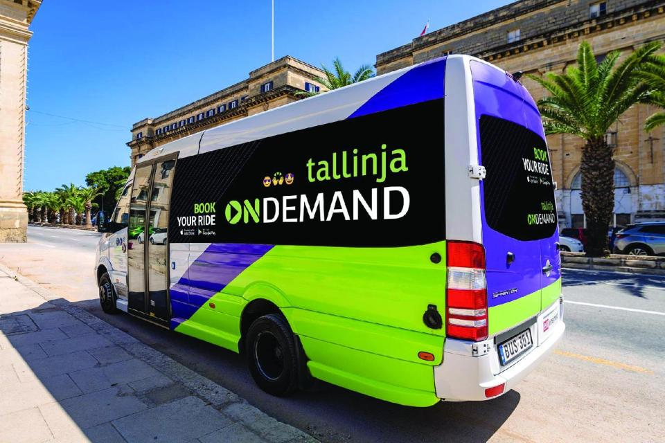
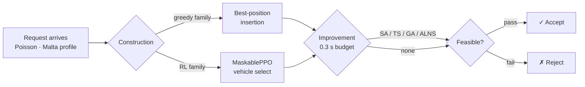

# Dynamic Bus Routing for On-Demand Public Transport

> BSc (Hons) AI thesis — University of Malta, June 2026  
> Miguel Baldacchino · Supervisor: Dr Josef Bajada

[](https://www.python.org/)
[](LICENSE)
[](0171205L_1.pdf)
[](https://miguelbaldacchino.github.io/Dynamic-Bus-Routing-for-On-Demand-Public-Transportation-/simulation_map.html)
[](#benchmark-results)

A modular discrete-event simulation and benchmarking framework for the **Dynamic Dial-a-Ride Problem (D-DARP)**, calibrated to Malta's *tallinja On Demand* service. Six routing-policy families — greedy insertion, SA, TS, GA, ALNS, and Maskable-PPO RL — are compared across 45 configurations under identical demand streams and travel-time noise.

<p align="center">
  
</p>

<p align="center">
  
  <br/>
  <sub>Sample run: 6 buses · 359 requests · 303 served · 56 rejected &nbsp;|&nbsp; <a href="https://miguelbaldacchino.github.io/Dynamic-Bus-Routing-for-On-Demand-Public-Transportation-/simulation_map.html"><strong>Open interactive map ↗</strong></a></sub>
</p>

---

## Dispatch pipeline



---

## Repository layout

```
odpt/
├── main.py                    # Entry point — runs one simulation episode
├── config.py                  # SimulationConfig dataclass (all hyperparameters)
├── dispatcher.py              # Policy-agnostic dispatch_request() interface
├── feasibility.py             # DARP constraint checker (capacity, TW, ride-time)
├── metrics.py                 # MetricsCollector → summary dict / report
├── models.py                  # Request, Vehicle, Stop dataclasses
├── benchmark.py               # Multi-seed, multi-policy orchestrator
│
├── malta_travel.py            # OSRM matrix + time-of-day congestion scaling
├── malta_travel_matrix.json   # Pre-built 72×72 road-network travel-time matrix
├── build_osrm_matrix.py       # Rebuilds matrix from scratch (Docker + OSRM)
├── stops.csv                  # 72 tallinja On Demand stops (lat/lon)
│
├── sa_policy.py               # Simulated Annealing improver
├── ts_policy.py               # Tabu Search improver
├── ga_policy.py               # Genetic Algorithm improver
├── alns_policy.py             # Adaptive Large Neighbourhood Search improver
│
├── rl_env.py                  # Gymnasium env (DARPEnv) — MaskablePPO
├── rl_train.py                # PPO training script
├── rl_tune_RL1-1.py           # Optuna tuning — Strategy 1 (standalone RL)
├── rl_tune_RL2-0.py           # Optuna tuning — Strategy 2 (TS-initialiser)
├── rl_outputs/                # Saved model checkpoints (.zip)
│
├── visualize.py               # Folium HTML map generator
└── route_cache.json           # OSRM road-geometry cache for visualisation

Benchmark Results/
├── Baseline - Default Config/
│   ├── baseline_report.txt    # Full metric tables across 45 policies × 5 seeds
│   └── runs/                  # Per-run JSON files
└── sensitivity_results/
    ├── demand_busy/           # ×1.5 demand intensity
    ├── fleet_4/               # Fleet size 4
    ├── capacity_8/            # Vehicle capacity 8
    ├── wait_15/               # Max wait Wmax = 15 min
    ├── ride_factor_2/         # Ride-time factor α = 2.0
    └── combined_stress/       # All degradations simultaneously

docs/
├── map.png                    # Simulation screenshot (shown above)
├── bus.png                    # tallinja On Demand minibus photo
└── simulation_map.html        # Interactive Folium map (GitHub Pages)
```

---

## Quick start

```bash
pip install simpy stable-baselines3 sb3-contrib gymnasium folium optuna

# Single run — default policy (greedy+sa), seed 42
python main.py

# Specify policy and seed
python main.py --policy greedy+alns --seed 100

# RL hybrid (requires a trained model)
python main.py --policy rl+ts --model rl_outputs/run_009/model_final.zip

# Full benchmark (all policies, 5 seeds)
python benchmark.py

# Generate interactive map for last run
python visualize.py  # → docs/simulation_map.html
```

---

## Routing policies

| Policy | Construction | Improvement | Time limit |
|---|---|---|---|
| `greedy` | Best-position insertion | — | — |
| `greedy+sa` | Greedy | Simulated Annealing | 0.3 s/vehicle |
| `greedy+ts` | Greedy | Tabu Search | 0.3 s/vehicle |
| `greedy+ga` | Greedy | Genetic Algorithm | 0.3 s/vehicle |
| `greedy+alns` | Greedy | ALNS | 0.3 s/vehicle |
| `rl` | MaskablePPO agent | — | — |
| `rl+sa` / `rl+ts` / `rl+ga` / `rl+alns` | MaskablePPO agent | SA / TS / GA / ALNS | 0.3 s/vehicle |

---

## Benchmark results

45 policy configurations evaluated over 5 seeds (mean ± σ). **6 of 7 Pareto-frontier policies are RL-construction hybrids.**

| Rank | Policy | Service rate | Mean wait | Note |
|---|---|---|---|---|
| 1 | `greedy+alns` | 79.9% ±4.1% | 13.67 min | Max coverage |
| 2 | `rl2.2+ga` | 78.2% | 13.61 min | |
| 3 | `rl2.2+ts` | 78.1% | 13.40 min | |
| 4 | `rl2.1+ts` | 77.8% | 13.35 min | |
| 5 | `rl2.0+alns` | 77.6% | 13.03 min | |
| **6** | **`rl2.0+ts`** | **76.2%** | **12.09 min** | **← Pareto knee** |
| 7 | `rl1.1+ts` | 68.0% | 8.71 min | Lowest wait |

`rl2.0+ts` is identified as the Pareto knee by minimum normalised utopia distance (0.749). `greedy+alns` maximises service coverage at the cost of slightly higher mean wait.

---

<details>
<summary><b>⚙️ Simulation parameters</b></summary>

| Parameter | Default | Notes |
|---|---|---|
| `fleet_size` | 6 | MPT On Demand fleet |
| `vehicle_capacity` | 16 | Minibus seats |
| `depot_node` | 0 | Ħal Qormi – Bankieri |
| `n_nodes` | 71 | Service-area stops (0 = depot) |
| `n_requests` | 400 | ~18 requests/hour over 17h day |
| `service_end` | 1020 min | 22:30 — last request accepted |
| `horizon` | 1140 min | 00:30 — simulation ends |
| `demand_profile` | `"malta"` | `uniform` / `peak` / `bimodal` / `malta` |
| `max_wait` | 30 min | Hard pickup deadline |
| `ride_factor` | 2.5 | Max ride = 2.5 × direct travel time |
| `travel_noise` | 0.15 | Lognormal σ on execution-time travel |
| `weights` | (1.0, 2.0, 2.5) | α distance, β wait, γ ride-time |

**Time-of-day congestion profile** — effective travel time = `τ(s,s′) / c(t)`

| Period | Window | c(t) |
|---|---|---|
| Early morning | 05:30–06:30 | 0.90 |
| Morning peak | 06:30–09:30 | 0.45 |
| Midday | 09:30–15:30 | 0.65 |
| Afternoon peak | 15:30–18:30 | 0.50 |
| Evening | 18:30–21:00 | 0.75 |
| Night | 21:00+ | 0.95 |

</details>

<details>
<summary><b>🤖 RL agent specification</b></summary>

- **Algorithm:** Maskable PPO (`sb3-contrib`) — infeasible vehicle assignments masked to `−∞` before softmax, enforcing feasibility by construction.
- **Action space:** `Discrete(K+1)` — assign to vehicle 1…K or reject.
- **Observation:** 74–105 features depending on variant — per-vehicle state (location, load, plan length, idle status, travel time to PU/DO), request features (PU/DO coords, direct time, elapsed), global (time-of-day, fleet busy fraction, speed factor c(t)), optionally anticipatory demand lookahead.
- **Training:** Up to 1,000,000 timesteps, `SubprocVecEnv` + `VecNormalize`. Hyperparameters tuned with Optuna (TPE sampler) jointly over reward weights and PPO params.

**Two training strategies:**

| Strategy | Description | Reward |
|---|---|---|
| RL1.x — standalone | Agent dispatches independently | Acceptance bonus − wait/ride/detour/cost penalties |
| RL2.x — TS-initialiser | Agent is construction phase of RL+TS pipeline | + fleet-balance bonus, growing rejection penalty; delegates ride-time to TS |

**Fixed PPO hyperparameters:**

| Param | Value |
|---|---|
| `net_arch` | [128, 128] |
| `n_steps` | 1024 |
| `batch_size` | 128 |
| `n_epochs` | 5 |
| `gae_lambda` | 0.95 |
| `clip_range` | 0.2 |
| `vf_coef` | 1.0 |

</details>

<details>
<summary><b>🗺️ Rebuilding the OSRM travel-time matrix</b></summary>

The 72×72 matrix is precomputed from the Malta OSM road network via a locally-deployed OSRM instance. `malta_travel_matrix.json` is committed so the simulation runs without Docker.

```bash
# Full pipeline (download PBF + Docker + matrix)
python build_osrm_matrix.py

# OSRM already running locally
python build_osrm_matrix.py --skip-docker --skip-download --osrm-url http://localhost:5000

# Use public OSRM server (no Docker)
python build_osrm_matrix.py --skip-docker --skip-download \
    --osrm-url http://router.project-osrm.org
```

</details>

<details>
<summary><b>📊 Sensitivity analysis scenarios</b></summary>

Six stress configurations tested by overriding `SimulationConfig` at benchmark time:

| Scenario | Override |
|---|---|
| Fleet size 4 | `fleet_size=4` |
| Vehicle capacity 8 | `vehicle_capacity=8` |
| Demand ×1.5 | `inter_arrival=2.0` |
| Tight time windows | `max_wait=15` |
| Stricter ride-time factor | `ride_factor=2.0` |
| Combined stress | all of the above |

Results in `Benchmark Results/sensitivity_results/`.

</details>

---

*Thesis submitted June 2026, Faculty of ICT, University of Malta.*